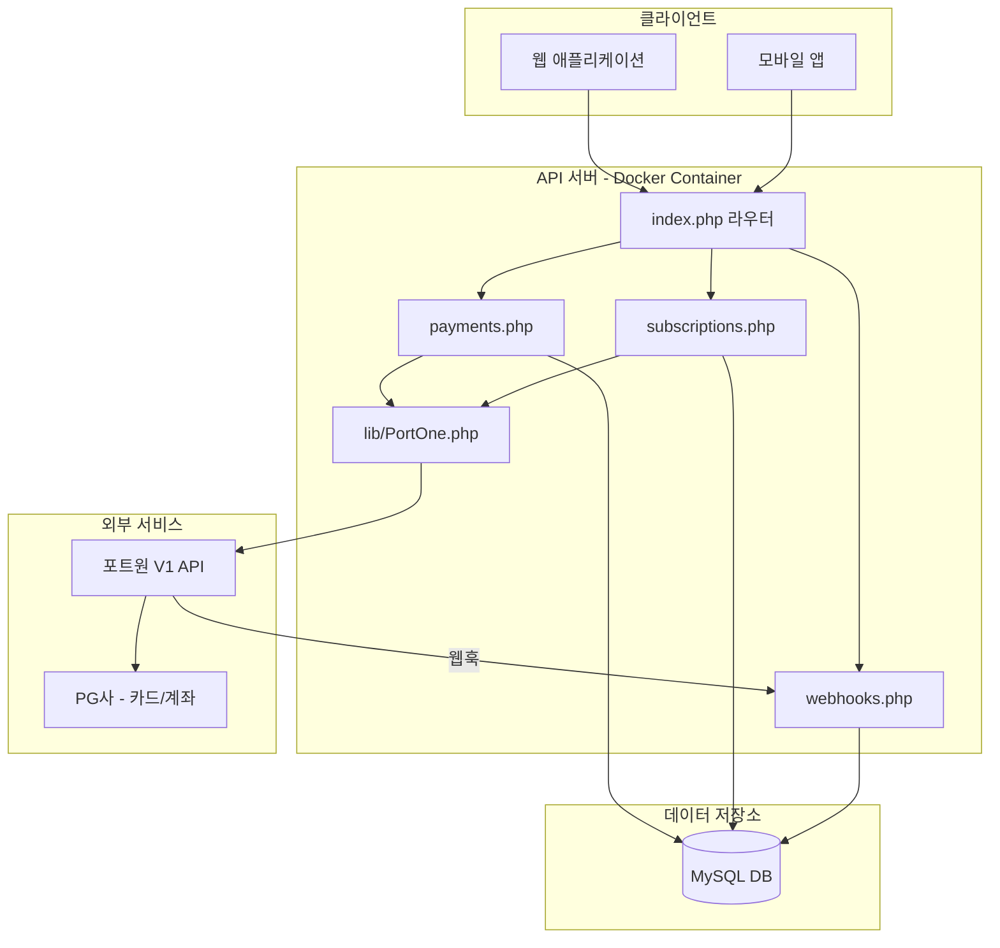

# 포트원 연동 결제 서비스 API 구현 계획

## 아키텍처 개요

## 구현할 파일 목록

### 1. 포트원 API 클라이언트 라이브러리

- **[api/v1/lib/PortOne.php](api/v1/lib/PortOne.php)** (신규)
  - 포트원 V1 API 인증 및 통신 담당
  - 토큰 발급/갱신, HTTP 요청 처리
  - 결제/취소/조회/빌링키/가상계좌 메서드

### 2. API 핸들러

- **[api/v1/handlers/payments.php](api/v1/handlers/payments.php)** (신규)
  - `GET /payments` - 결제 목록 조회
  - `GET /payments/{id}` - 결제 상세 조회
  - `POST /payments/prepare` - 결제 사전등록
  - `POST /payments/cancel` - 결제 취소
  - `POST /payments/vbank` - 가상계좌 발급

- **[api/v1/handlers/subscriptions.php](api/v1/handlers/subscriptions.php)** (신규)
  - `POST /subscriptions/billing-key` - 빌링키 발급
  - `DELETE /subscriptions/billing-key/{customer_uid}` - 빌링키 삭제
  - `POST /subscriptions/pay` - 빌링키로 결제
  - `POST /subscriptions/schedule` - 예약 결제 등록
  - `GET /subscriptions/schedule/{customer_uid}` - 예약 결제 조회

- **[api/v1/handlers/webhooks.php](api/v1/handlers/webhooks.php)** (신규)
  - `POST /webhooks/portone` - 포트원 웹훅 수신
  - 결제 완료/취소/가상계좌 입금 이벤트 처리

### 3. 라우터 수정

- **[api/v1/index.php](api/v1/index.php)** (수정)
  - payments, subscriptions, webhooks 라우트 추가

### 4. 설정 및 환경변수

- **[.env.example](.env.example)** (수정)
  - 포트원 API 키 설정 추가

- **[config/database.php](config/database.php)** (수정)
  - 포트원 설정 상수 추가

### 5. 데이터베이스 스키마

- **[db/init.sql](db/init.sql)** (수정)
  - `payments` 테이블: 결제 내역 저장
  - `billing_keys` 테이블: 빌링키 정보
  - `payment_schedules` 테이블: 예약 결제
  - `webhook_logs` 테이블: 웹훅 로그

### 6. Docker 설정

- **[Dockerfile](Dockerfile)** (신규)
  - PHP 8.x + Apache 기반 이미지
  - curl, pdo_mysql 확장 포함

- **[docker-compose.yml](docker-compose.yml)** (신규)
  - API 서버 + MySQL 컨테이너 구성

## API 엔드포인트 명세

| Method | Endpoint | 설명 |

|--------|----------|------|

| GET | /api/v1/payments | 결제 목록 조회 |

| GET | /api/v1/payments/{imp_uid} | 결제 상세 조회 |

| POST | /api/v1/payments/prepare | 결제 사전등록 |

| POST | /api/v1/payments/cancel | 결제 취소/환불 |

| POST | /api/v1/payments/vbank | 가상계좌 발급 |

| POST | /api/v1/subscriptions/billing-key | 빌링키 발급 요청 |

| DELETE | /api/v1/subscriptions/billing-key/{id} | 빌링키 삭제 |

| POST | /api/v1/subscriptions/pay | 빌링키 결제 |

| POST | /api/v1/subscriptions/schedule | 예약 결제 등록 |

| GET | /api/v1/subscriptions/schedule/{id} | 예약 결제 조회 |

| DELETE | /api/v1/subscriptions/schedule/{id} | 예약 결제 취소 |

| POST | /api/v1/webhooks/portone | 웹훅 수신 |

## 핵심 구현 사항

### 포트원 V1 API 인증 흐름

1. API Key + Secret으로 액세스 토큰 발급
2. 토큰 만료 시 자동 갱신
3. 모든 API 요청에 Bearer 토큰 사용

### 보안 고려사항

- API Key는 환경변수로 관리
- 웹훅 검증 (imp_uid로 결제 정보 재조회)
- 금액 위변조 검증 (사전등록 금액과 비교)